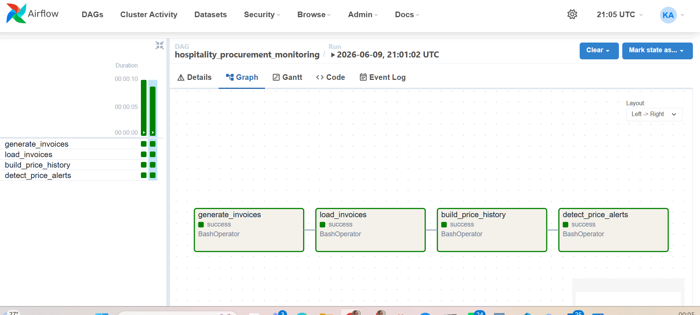
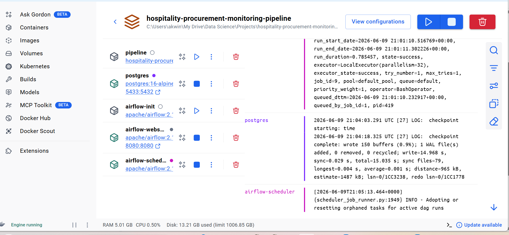
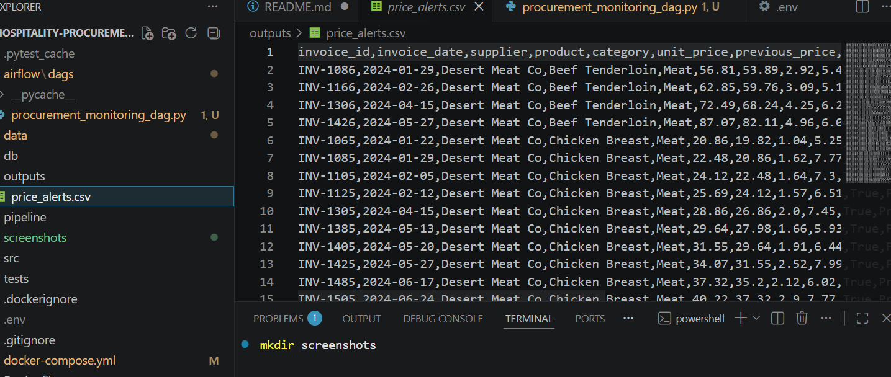

# Hospitality Procurement & Cost Monitoring Pipeline

Python | Pandas | PostgreSQL | SQLAlchemy | Docker | Docker Compose | Apache Airflow | YAML | Pytest

An end-to-end **data engineering pipeline** that simulates how a hospitality business can monitor supplier pricing, track historical price changes, and automatically generate alerts when unusual price increases occur.

The project models a realistic hotel or restaurant procurement workflow where supplier invoices are **ingested, cleaned, transformed, and analyzed** to detect cost anomalies that could impact operational margins.

---

# Business Problem

Hospitality businesses rely on multiple suppliers for products such as:

- vegetables
- meat
- seafood
- dairy
- beverages

Over time, supplier prices can change gradually or spike unexpectedly.

Without a monitoring system, these changes may go unnoticed and lead to:

- rising food and beverage costs
- procurement inefficiencies
- weaker supplier negotiation leverage
- reduced operating margins

This pipeline demonstrates how a simple **data engineering system** can detect these changes automatically.

---

# Project Goals

This project demonstrates core **data engineering concepts** including:

- raw data generation and ingestion
- schema validation and data cleaning
- PostgreSQL-based data storage
- Dockerized pipeline deployment
- workflow orchestration using Apache Airflow
- task dependency management and scheduling
- Containerized development environment
- transformation into analytics-ready tables
- automated monitoring logic for price increases
- configuration-driven pipeline behavior
- end-to-end pipeline execution from a single runner script

---

# Tech Stack

Python
Pandas
PostgreSQL
Docker
Apache Airflow
SQLAlchemy

---

# Project Structure

```text
hospitality-procurement-monitoring-pipeline/
│
├── data/
│   ├── raw/
│   │   └── supplier_invoices.csv
│   └── processed/
│
├── outputs/
│   └── price_alerts.csv
│
├── airflow/
│   └── dags/
│       └── procurement_monitoring_dag.py
├── pipeline/
│   └── run_pipeline.py
│
├── src/
│   ├── config/
│   │   └── settings.yaml
│   │
│   ├── database/
│   │   └── postgres_connection.py
│   │
│   ├── ingestion/
│   │   ├── generate_invoices.py
│   │   └── load_invoices.py
│   │
│   ├── transform/
│   │   └── build_price_history.py
│   │
│   ├── monitoring/
│   │   └── detect_price_alerts.py
│   │
│   └── utils/
│       └── helpers.py
│
├── tests/
│   └── test_pipeline.py
│
├── Dockerfile
├── docker-compose.yml
├── .dockerignore
├── requirements.txt
├── .gitignore
└── README.md
```

# Pipeline Architecture

Synthetic Supplier Invoice Data
        │
        ▼
Apache Airflow DAG
        │
        ▼
generate_invoices
        │
        ▼
load_invoices
        │
        ▼
build_price_history
        │
        ▼
detect_price_alerts
        │
        ▼
PostgreSQL Tables
        │
        ▼
Alerts CSV Output

---

# Dataset

The project uses a **synthetic but realistic hospitality procurement dataset** containing:

- **5 suppliers**
- **20 hospitality-related products**
- **weekly invoice records**
- **changing supplier prices over time**
- **intentionally injected data quality issues**

Example columns:

- `invoice_id`
- `invoice_date`
- `supplier`
- `product`
- `category`
- `quantity`
- `unit_price`
- `total_amount`

---

# Example Data Quality Issues

To simulate real operational data challenges, the dataset includes:

- one missing unit price  
- one supplier naming inconsistency  
- one duplicate row  

These issues are automatically handled during the ingestion and cleaning stage.

---

# Tables Created

### `raw_invoices`
Cleaned invoice data stored in PostgreSQL.

### `price_history`
A transformed analytics table containing:

- previous price  
- price change  
- percentage price change  

### `price_alerts`
Rows where the percentage price increase exceeds the configured alert threshold.

---

# Configuration

Pipeline configuration is stored in:

```
src/config/settings.yaml
```

This controls:

- dataset date range  
- database path  
- output CSV path  
- alert threshold  

Example:

```yaml
monitoring:
  alert_threshold_pct: 5.0
  ```

How to Run

### 1. Install dependencies

```
python -m pip install -r requirements.txt
```

### 2. Run the pipeline

```
python -m pipeline.run_pipeline
```

If using a specific interpreter:

```
"C:\path\to\python.exe" pipeline/run_pipeline.py
```

### 2. Run with Docker

```
docker compose up
```
1. Start a PostgreSQL container
2. Wait for the database to become healthy
3. Execute the procurement monitoring pipeline
4. Load data into PostgreSQL
5. Generate procurement alerts
6. Export alerts to CSV

# Pipeline Steps

The pipeline executes the following stages:

### 1. generate_invoices.py

- generates synthetic weekly supplier invoice data

### 2. load_invoices.py

- validates schema
- standardizes supplier names
- removes critical nulls
- removes duplicate rows
- loads cleaned data into PostgreSQL

### 3. build_price_history.py

- reads raw_invoices
- calculates previous price, price change, and percent change
- writes the price_history table

### 4. detect_price_alerts.py

- reads price_history
- flags price increases above the configured threshold
- writes price_alerts
- exports outputs/price_alerts.csv

# Apache Airflow Orchestration

The pipeline is orchestrated using Apache Airflow.

The DAG defines four dependent tasks:

1. generate_invoices
2. load_invoices
3. build_price_history
4. detect_price_alerts

Task dependencies:

generate_invoices
        ↓
load_invoices
        ↓
build_price_history
        ↓
detect_price_alerts

Airflow provides:

- workflow orchestration
- task dependency management
- execution monitoring
- task logs
- retry capability
- scheduling support

# Outputs

After running the pipeline, the following artifacts are created:

PostgreSQL Tables

- raw_invoices
- price_history
- price_alerts

CSV Output

- outputs/price_alerts.csv

# Example Results

For the current dataset:

- 521 raw rows generated
- 519 clean rows loaded into PostgreSQL
- 112 price alerts detected above the 5% threshold

# Skills Demonstrated

This project demonstrates:

- ETL pipeline development
- PostgreSQL database design
- SQLAlchemy integration
- Data quality validation
- Transformation pipelines
- Automated monitoring and alerting
- Docker containerization
- Docker Compose orchestration
- Apache Airflow orchestration
- Workflow scheduling
- DAG design
- Task dependency management
- Configuration-driven pipelines
- Git version control

# Future Improvements

Possible extensions include:

- Procurement analytics dashboard (Power BI)
- Azure cloud deployment
- CI/CD automation with GitHub Actions
- Automated data quality monitoring
- Email or Slack alert notifications
- Incremental loading strategy

# Docker Architecture

The project runs using Docker Compose and consists of two services:

1. PostgreSQL Container
   - Stores raw and transformed procurement data
   - Hosts analytics tables and monitoring outputs

2. Pipeline Container
   - Executes the ETL pipeline
   - Loads data into PostgreSQL
   - Builds analytics tables
   - Generates procurement alerts

The entire environment can be reproduced with:

docker compose up

# Screenshots

## Airflow DAG



## Docker Environment



## Example Price Alerts



# Why This Project Matters

This project intentionally focuses on a hospitality operations use case rather than a generic dataset. It combines domain relevance with data engineering structure to demonstrate practical pipeline design for real operational workflows.